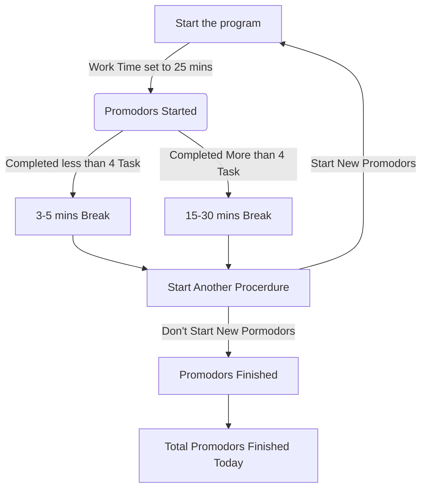

# Promodoro Timer Application

 ## Pomodoro Technique
 It’s a hyper-productivity method that focuses on dividing your working time into chunks of 25 minutes of intense work combined with 5 minute breaks.

### There are six steps in this techniques
1. Decide on the task to be done
2. Set the Pormodoro timer (25 minutes)
3. Work on the task
4. End the work when the timer rings
5. If you have fewer than four checkmarks, take a short break (3-5 minutes) and then return to step 2; otherwise continue to step 6
6. After four pomodoros, take a longer break (15-30 minutes), reset your checkmark count to zero, then go to step 1

[![](https://mermaid.ink/img/eyJjb2RlIjoiZ3JhcGggVERcbiAgIEFbU3RhcnQgdGhlIHByb2dyYW1dIC0tPnxXb3JrIFRpbWUgc2V0IHRvIDI1IG1pbnN8IEIoUHJvbW9kb3JzIFN0YXJ0ZWQpO1xuICAgQiAtLT4gfENvbXBsZXRlZCBsZXNzIHRoYW4gNCBUYXNrfCBDWzMtNSBtaW5zIEJyZWFrXVxuICAgQiAtLT4gfENvbXBsZXRlZCBNb3JlIHRoYW4gNCBUYXNrfCBEWzE1LTMwIG1pbnMgQnJlYWtdXG4gICBDIC0tPiBFW1N0YXJ0IEFub3RoZXIgUHJvY2VyZHVyZV1cbiAgIEQgLS0-IEVcbiAgIEUgLS0-IHxEb24ndCBTdGFydCBOZXcgUG9ybW9kb3JzfCBGW1Byb21vZG9ycyBGaW5pc2hlZF1cbiAgIEUgLS0-IHxTdGFydCBOZXcgUHJvbW9kb3JzfCBBXG4gICBGIC0tPiBHW1RvdGFsIFByb21vZG9ycyBGaW5pc2hlZCBUb2RheV0iLCJtZXJtYWlkIjp7InRoZW1lIjoiZm9yZXN0IiwidGhlbWVWYXJpYWJsZXMiOnsiYmFja2dyb3VuZCI6IndoaXRlIiwicHJpbWFyeUNvbG9yIjoiI2NkZTQ5OCIsInNlY29uZGFyeUNvbG9yIjoiI2NkZmZiMiIsIm1haW5Ca2ciOiIjY2RlNDk4Iiwic2Vjb25kQmtnIjoiI2NkZmZiMiIsImxpbmVDb2xvciI6IiMwMDAwMDAiLCJib3JkZXIxIjoiIzEzNTQwYyIsImJvcmRlcjIiOiIjNmVhYTQ5IiwiYXJyb3doZWFkQ29sb3IiOiJncmVlbiIsImZvbnRGYW1pbHkiOiJcInRyZWJ1Y2hldCBtc1wiLCB2ZXJkYW5hLCBhcmlhbCIsImZvbnRTaXplIjoiMTZweCIsInRlcnRpYXJ5Q29sb3IiOiJoc2woNzguMTU3ODk0NzM2OCwgNTguNDYxNTM4NDYxNSUsIDg0LjUwOTgwMzkyMTYlKSIsInByaW1hcnlCb3JkZXJDb2xvciI6ImhzbCg3OC4xNTc4OTQ3MzY4LCAxOC40NjE1Mzg0NjE1JSwgNjQuNTA5ODAzOTIxNiUpIiwic2Vjb25kYXJ5Qm9yZGVyQ29sb3IiOiJoc2woOTguOTYxMDM4OTYxLCA2MCUsIDc0LjkwMTk2MDc4NDMlKSIsInRlcnRpYXJ5Qm9yZGVyQ29sb3IiOiJoc2woNzguMTU3ODk0NzM2OCwgMTguNDYxNTM4NDYxNSUsIDc0LjUwOTgwMzkyMTYlKSIsInByaW1hcnlUZXh0Q29sb3IiOiIjMzIxYjY3Iiwic2Vjb25kYXJ5VGV4dENvbG9yIjoiIzMyMDA0ZCIsInRlcnRpYXJ5VGV4dENvbG9yIjoiIzMyMWI2NyIsInRleHRDb2xvciI6IiMwMDAwMDAiLCJub2RlQmtnIjoiI2NkZTQ5OCIsIm5vZGVCb3JkZXIiOiIjMTM1NDBjIiwiY2x1c3RlckJrZyI6IiNjZGZmYjIiLCJjbHVzdGVyQm9yZGVyIjoiIzZlYWE0OSIsImRlZmF1bHRMaW5rQ29sb3IiOiIjMDAwMDAwIiwidGl0bGVDb2xvciI6IiMzMzMiLCJlZGdlTGFiZWxCYWNrZ3JvdW5kIjoiI2U4ZThlOCIsImFjdG9yQm9yZGVyIjoiaHNsKDc4LjE1Nzg5NDczNjgsIDU4LjQ2MTUzODQ2MTUlLCA1NC41MDk4MDM5MjE2JSkiLCJhY3RvckJrZyI6IiNjZGU0OTgiLCJhY3RvclRleHRDb2xvciI6ImJsYWNrIiwiYWN0b3JMaW5lQ29sb3IiOiJncmV5Iiwic2lnbmFsQ29sb3IiOiIjMzMzIiwic2lnbmFsVGV4dENvbG9yIjoiIzMzMyIsImxhYmVsQm94QmtnQ29sb3IiOiIjY2RlNDk4IiwibGFiZWxCb3hCb3JkZXJDb2xvciI6IiMzMjY5MzIiLCJsYWJlbFRleHRDb2xvciI6ImJsYWNrIiwibG9vcFRleHRDb2xvciI6ImJsYWNrIiwibm90ZUJvcmRlckNvbG9yIjoiIzZlYWE0OSIsIm5vdGVCa2dDb2xvciI6IiNmZmY1YWQiLCJub3RlVGV4dENvbG9yIjoiYmxhY2siLCJhY3RpdmF0aW9uQm9yZGVyQ29sb3IiOiIjNjY2IiwiYWN0aXZhdGlvbkJrZ0NvbG9yIjoiI2Y0ZjRmNCIsInNlcXVlbmNlTnVtYmVyQ29sb3IiOiJ3aGl0ZSIsInNlY3Rpb25Ca2dDb2xvciI6IiM2ZWFhNDkiLCJhbHRTZWN0aW9uQmtnQ29sb3IiOiJ3aGl0ZSIsInNlY3Rpb25Ca2dDb2xvcjIiOiIjNmVhYTQ5IiwidGFza0JvcmRlckNvbG9yIjoiIzEzNTQwYyIsInRhc2tCa2dDb2xvciI6IiM0ODdlM2EiLCJ0YXNrVGV4dExpZ2h0Q29sb3IiOiJ3aGl0ZSIsInRhc2tUZXh0Q29sb3IiOiJ3aGl0ZSIsInRhc2tUZXh0RGFya0NvbG9yIjoiYmxhY2siLCJ0YXNrVGV4dE91dHNpZGVDb2xvciI6ImJsYWNrIiwidGFza1RleHRDbGlja2FibGVDb2xvciI6IiMwMDMxNjMiLCJhY3RpdmVUYXNrQm9yZGVyQ29sb3IiOiIjMTM1NDBjIiwiYWN0aXZlVGFza0JrZ0NvbG9yIjoiI2NkZTQ5OCIsImdyaWRDb2xvciI6ImxpZ2h0Z3JleSIsImRvbmVUYXNrQmtnQ29sb3IiOiJsaWdodGdyZXkiLCJkb25lVGFza0JvcmRlckNvbG9yIjoiZ3JleSIsImNyaXRCb3JkZXJDb2xvciI6IiNmZjg4ODgiLCJjcml0QmtnQ29sb3IiOiJyZWQiLCJ0b2RheUxpbmVDb2xvciI6InJlZCIsImxhYmVsQ29sb3IiOiJibGFjayIsImVycm9yQmtnQ29sb3IiOiIjNTUyMjIyIiwiZXJyb3JUZXh0Q29sb3IiOiIjNTUyMjIyIiwiY2xhc3NUZXh0IjoiIzMyMWI2NyIsImZpbGxUeXBlMCI6IiNjZGU0OTgiLCJmaWxsVHlwZTEiOiIjY2RmZmIyIiwiZmlsbFR5cGUyIjoiaHNsKDE0Mi4xNTc4OTQ3MzY4LCA1OC40NjE1Mzg0NjE1JSwgNzQuNTA5ODAzOTIxNiUpIiwiZmlsbFR5cGUzIjoiaHNsKDE2Mi45NjEwMzg5NjEsIDEwMCUsIDg0LjkwMTk2MDc4NDMlKSIsImZpbGxUeXBlNCI6ImhzbCgxNC4xNTc4OTQ3MzY4LCA1OC40NjE1Mzg0NjE1JSwgNzQuNTA5ODAzOTIxNiUpIiwiZmlsbFR5cGU1IjoiaHNsKDM0Ljk2MTAzODk2MSwgMTAwJSwgODQuOTAxOTYwNzg0MyUpIiwiZmlsbFR5cGU2IjoiaHNsKDIwNi4xNTc4OTQ3MzY4LCA1OC40NjE1Mzg0NjE1JSwgNzQuNTA5ODAzOTIxNiUpIiwiZmlsbFR5cGU3IjoiaHNsKDIyNi45NjEwMzg5NjEsIDEwMCUsIDg0LjkwMTk2MDc4NDMlKSJ9fX0)](https://mermaid-js.github.io/mermaid-live-editor/#/edit/eyJjb2RlIjoiZ3JhcGggVERcbiAgIEFbU3RhcnQgdGhlIHByb2dyYW1dIC0tPnxXb3JrIFRpbWUgc2V0IHRvIDI1IG1pbnN8IEIoUHJvbW9kb3JzIFN0YXJ0ZWQpO1xuICAgQiAtLT4gfENvbXBsZXRlZCBsZXNzIHRoYW4gNCBUYXNrfCBDWzMtNSBtaW5zIEJyZWFrXVxuICAgQiAtLT4gfENvbXBsZXRlZCBNb3JlIHRoYW4gNCBUYXNrfCBEWzE1LTMwIG1pbnMgQnJlYWtdXG4gICBDIC0tPiBFW1N0YXJ0IEFub3RoZXIgUHJvY2VyZHVyZV1cbiAgIEQgLS0-IEVcbiAgIEUgLS0-IHxEb24ndCBTdGFydCBOZXcgUG9ybW9kb3JzfCBGW1Byb21vZG9ycyBGaW5pc2hlZF1cbiAgIEUgLS0-IHxTdGFydCBOZXcgUHJvbW9kb3JzfCBBXG4gICBGIC0tPiBHW1RvdGFsIFByb21vZG9ycyBGaW5pc2hlZCBUb2RheV0iLCJtZXJtYWlkIjp7InRoZW1lIjoiZm9yZXN0IiwidGhlbWVWYXJpYWJsZXMiOnsiYmFja2dyb3VuZCI6IndoaXRlIiwicHJpbWFyeUNvbG9yIjoiI2NkZTQ5OCIsInNlY29uZGFyeUNvbG9yIjoiI2NkZmZiMiIsIm1haW5Ca2ciOiIjY2RlNDk4Iiwic2Vjb25kQmtnIjoiI2NkZmZiMiIsImxpbmVDb2xvciI6IiMwMDAwMDAiLCJib3JkZXIxIjoiIzEzNTQwYyIsImJvcmRlcjIiOiIjNmVhYTQ5IiwiYXJyb3doZWFkQ29sb3IiOiJncmVlbiIsImZvbnRGYW1pbHkiOiJcInRyZWJ1Y2hldCBtc1wiLCB2ZXJkYW5hLCBhcmlhbCIsImZvbnRTaXplIjoiMTZweCIsInRlcnRpYXJ5Q29sb3IiOiJoc2woNzguMTU3ODk0NzM2OCwgNTguNDYxNTM4NDYxNSUsIDg0LjUwOTgwMzkyMTYlKSIsInByaW1hcnlCb3JkZXJDb2xvciI6ImhzbCg3OC4xNTc4OTQ3MzY4LCAxOC40NjE1Mzg0NjE1JSwgNjQuNTA5ODAzOTIxNiUpIiwic2Vjb25kYXJ5Qm9yZGVyQ29sb3IiOiJoc2woOTguOTYxMDM4OTYxLCA2MCUsIDc0LjkwMTk2MDc4NDMlKSIsInRlcnRpYXJ5Qm9yZGVyQ29sb3IiOiJoc2woNzguMTU3ODk0NzM2OCwgMTguNDYxNTM4NDYxNSUsIDc0LjUwOTgwMzkyMTYlKSIsInByaW1hcnlUZXh0Q29sb3IiOiIjMzIxYjY3Iiwic2Vjb25kYXJ5VGV4dENvbG9yIjoiIzMyMDA0ZCIsInRlcnRpYXJ5VGV4dENvbG9yIjoiIzMyMWI2NyIsInRleHRDb2xvciI6IiMwMDAwMDAiLCJub2RlQmtnIjoiI2NkZTQ5OCIsIm5vZGVCb3JkZXIiOiIjMTM1NDBjIiwiY2x1c3RlckJrZyI6IiNjZGZmYjIiLCJjbHVzdGVyQm9yZGVyIjoiIzZlYWE0OSIsImRlZmF1bHRMaW5rQ29sb3IiOiIjMDAwMDAwIiwidGl0bGVDb2xvciI6IiMzMzMiLCJlZGdlTGFiZWxCYWNrZ3JvdW5kIjoiI2U4ZThlOCIsImFjdG9yQm9yZGVyIjoiaHNsKDc4LjE1Nzg5NDczNjgsIDU4LjQ2MTUzODQ2MTUlLCA1NC41MDk4MDM5MjE2JSkiLCJhY3RvckJrZyI6IiNjZGU0OTgiLCJhY3RvclRleHRDb2xvciI6ImJsYWNrIiwiYWN0b3JMaW5lQ29sb3IiOiJncmV5Iiwic2lnbmFsQ29sb3IiOiIjMzMzIiwic2lnbmFsVGV4dENvbG9yIjoiIzMzMyIsImxhYmVsQm94QmtnQ29sb3IiOiIjY2RlNDk4IiwibGFiZWxCb3hCb3JkZXJDb2xvciI6IiMzMjY5MzIiLCJsYWJlbFRleHRDb2xvciI6ImJsYWNrIiwibG9vcFRleHRDb2xvciI6ImJsYWNrIiwibm90ZUJvcmRlckNvbG9yIjoiIzZlYWE0OSIsIm5vdGVCa2dDb2xvciI6IiNmZmY1YWQiLCJub3RlVGV4dENvbG9yIjoiYmxhY2siLCJhY3RpdmF0aW9uQm9yZGVyQ29sb3IiOiIjNjY2IiwiYWN0aXZhdGlvbkJrZ0NvbG9yIjoiI2Y0ZjRmNCIsInNlcXVlbmNlTnVtYmVyQ29sb3IiOiJ3aGl0ZSIsInNlY3Rpb25Ca2dDb2xvciI6IiM2ZWFhNDkiLCJhbHRTZWN0aW9uQmtnQ29sb3IiOiJ3aGl0ZSIsInNlY3Rpb25Ca2dDb2xvcjIiOiIjNmVhYTQ5IiwidGFza0JvcmRlckNvbG9yIjoiIzEzNTQwYyIsInRhc2tCa2dDb2xvciI6IiM0ODdlM2EiLCJ0YXNrVGV4dExpZ2h0Q29sb3IiOiJ3aGl0ZSIsInRhc2tUZXh0Q29sb3IiOiJ3aGl0ZSIsInRhc2tUZXh0RGFya0NvbG9yIjoiYmxhY2siLCJ0YXNrVGV4dE91dHNpZGVDb2xvciI6ImJsYWNrIiwidGFza1RleHRDbGlja2FibGVDb2xvciI6IiMwMDMxNjMiLCJhY3RpdmVUYXNrQm9yZGVyQ29sb3IiOiIjMTM1NDBjIiwiYWN0aXZlVGFza0JrZ0NvbG9yIjoiI2NkZTQ5OCIsImdyaWRDb2xvciI6ImxpZ2h0Z3JleSIsImRvbmVUYXNrQmtnQ29sb3IiOiJsaWdodGdyZXkiLCJkb25lVGFza0JvcmRlckNvbG9yIjoiZ3JleSIsImNyaXRCb3JkZXJDb2xvciI6IiNmZjg4ODgiLCJjcml0QmtnQ29sb3IiOiJyZWQiLCJ0b2RheUxpbmVDb2xvciI6InJlZCIsImxhYmVsQ29sb3IiOiJibGFjayIsImVycm9yQmtnQ29sb3IiOiIjNTUyMjIyIiwiZXJyb3JUZXh0Q29sb3IiOiIjNTUyMjIyIiwiY2xhc3NUZXh0IjoiIzMyMWI2NyIsImZpbGxUeXBlMCI6IiNjZGU0OTgiLCJmaWxsVHlwZTEiOiIjY2RmZmIyIiwiZmlsbFR5cGUyIjoiaHNsKDE0Mi4xNTc4OTQ3MzY4LCA1OC40NjE1Mzg0NjE1JSwgNzQuNTA5ODAzOTIxNiUpIiwiZmlsbFR5cGUzIjoiaHNsKDE2Mi45NjEwMzg5NjEsIDEwMCUsIDg0LjkwMTk2MDc4NDMlKSIsImZpbGxUeXBlNCI6ImhzbCgxNC4xNTc4OTQ3MzY4LCA1OC40NjE1Mzg0NjE1JSwgNzQuNTA5ODAzOTIxNiUpIiwiZmlsbFR5cGU1IjoiaHNsKDM0Ljk2MTAzODk2MSwgMTAwJSwgODQuOTAxOTYwNzg0MyUpIiwiZmlsbFR5cGU2IjoiaHNsKDIwNi4xNTc4OTQ3MzY4LCA1OC40NjE1Mzg0NjE1JSwgNzQuNTA5ODAzOTIxNiUpIiwiZmlsbFR5cGU3IjoiaHNsKDIyNi45NjEwMzg5NjEsIDEwMCUsIDg0LjkwMTk2MDc4NDMlKSJ9fX0)

