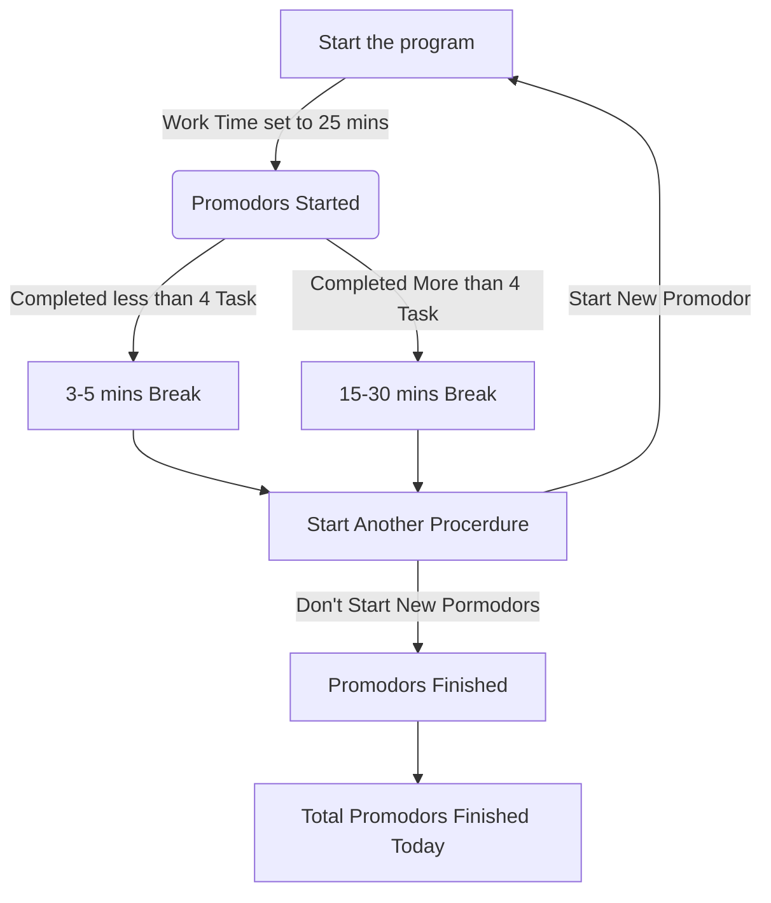

# Promodoro Timer Application

 ## Pomodoro Technique
 It’s a hyper-productivity method that focuses on dividing your working time into chunks of 25 minutes of intense work combined with 5 minute breaks.

### There are six steps in this techniques
1. Decide on the task to be done
2. Set the Pormodoro timer (25 minutes)
3. Work on the task
4. End the work when the timer rings
5. If you have fewer than four checkmarks, take a short break (3-5 minutes) and then return to step 2; otherwise continue to step 6
6. After four pomodoros, take a longer break (15-30 minutes), reset your checkmark count to zero, then go to step 1

[![](https://mermaid.ink/img/eyJjb2RlIjoiZ3JhcGggVERcbiAgIEFbU3RhcnQgdGhlIHByb2dyYW1dIC0tPnxXb3JrIFRpbWUgc2V0IHRvIDI1IG1pbnN8IEIoUHJvbW9kb3JzIFN0YXJ0ZWQpO1xuICAgQiAtLT4gfENvbXBsZXRlZCBsZXNzIHRoYW4gNCBUYXNrfCBDWzMtNSBtaW5zIEJyZWFrXVxuICAgQiAtLT4gfENvbXBsZXRlZCBNb3JlIHRoYW4gNCBUYXNrfCBEWzE1LTMwIG1pbnMgQnJlYWtdXG4gICBDIC0tPiBFW1N0YXJ0IEFub3RoZXIgUHJvY2VyZHVyZV1cbiAgIEQgLS0-IEVcbiAgIEUgLS0-IHxEb24ndCBTdGFydCBOZXcgUG9ybW9kb3JzfCBGW1Byb21vZG9ycyBGaW5pc2hlZF1cbiAgIEUgLS0-IHxTdGFydCBOZXcgUHJvbW9kb3J8IEFcbiAgIEYgLS0-IEdbVG90YWwgUHJvbW9kb3JzIEZpbmlzaGVkIFRvZGF5XSIsIm1lcm1haWQiOnsidGhlbWUiOiJmb3Jlc3QiLCJ0aGVtZVZhcmlhYmxlcyI6eyJiYWNrZ3JvdW5kIjoid2hpdGUiLCJwcmltYXJ5Q29sb3IiOiIjY2RlNDk4Iiwic2Vjb25kYXJ5Q29sb3IiOiIjY2RmZmIyIiwibWFpbkJrZyI6IiNjZGU0OTgiLCJzZWNvbmRCa2ciOiIjY2RmZmIyIiwibGluZUNvbG9yIjoiIzAwMDAwMCIsImJvcmRlcjEiOiIjMTM1NDBjIiwiYm9yZGVyMiI6IiM2ZWFhNDkiLCJhcnJvd2hlYWRDb2xvciI6ImdyZWVuIiwiZm9udEZhbWlseSI6IlwidHJlYnVjaGV0IG1zXCIsIHZlcmRhbmEsIGFyaWFsIiwiZm9udFNpemUiOiIxNnB4IiwidGVydGlhcnlDb2xvciI6ImhzbCg3OC4xNTc4OTQ3MzY4LCA1OC40NjE1Mzg0NjE1JSwgODQuNTA5ODAzOTIxNiUpIiwicHJpbWFyeUJvcmRlckNvbG9yIjoiaHNsKDc4LjE1Nzg5NDczNjgsIDE4LjQ2MTUzODQ2MTUlLCA2NC41MDk4MDM5MjE2JSkiLCJzZWNvbmRhcnlCb3JkZXJDb2xvciI6ImhzbCg5OC45NjEwMzg5NjEsIDYwJSwgNzQuOTAxOTYwNzg0MyUpIiwidGVydGlhcnlCb3JkZXJDb2xvciI6ImhzbCg3OC4xNTc4OTQ3MzY4LCAxOC40NjE1Mzg0NjE1JSwgNzQuNTA5ODAzOTIxNiUpIiwicHJpbWFyeVRleHRDb2xvciI6IiMzMjFiNjciLCJzZWNvbmRhcnlUZXh0Q29sb3IiOiIjMzIwMDRkIiwidGVydGlhcnlUZXh0Q29sb3IiOiIjMzIxYjY3IiwidGV4dENvbG9yIjoiIzAwMDAwMCIsIm5vZGVCa2ciOiIjY2RlNDk4Iiwibm9kZUJvcmRlciI6IiMxMzU0MGMiLCJjbHVzdGVyQmtnIjoiI2NkZmZiMiIsImNsdXN0ZXJCb3JkZXIiOiIjNmVhYTQ5IiwiZGVmYXVsdExpbmtDb2xvciI6IiMwMDAwMDAiLCJ0aXRsZUNvbG9yIjoiIzMzMyIsImVkZ2VMYWJlbEJhY2tncm91bmQiOiIjZThlOGU4IiwiYWN0b3JCb3JkZXIiOiJoc2woNzguMTU3ODk0NzM2OCwgNTguNDYxNTM4NDYxNSUsIDU0LjUwOTgwMzkyMTYlKSIsImFjdG9yQmtnIjoiI2NkZTQ5OCIsImFjdG9yVGV4dENvbG9yIjoiYmxhY2siLCJhY3RvckxpbmVDb2xvciI6ImdyZXkiLCJzaWduYWxDb2xvciI6IiMzMzMiLCJzaWduYWxUZXh0Q29sb3IiOiIjMzMzIiwibGFiZWxCb3hCa2dDb2xvciI6IiNjZGU0OTgiLCJsYWJlbEJveEJvcmRlckNvbG9yIjoiIzMyNjkzMiIsImxhYmVsVGV4dENvbG9yIjoiYmxhY2siLCJsb29wVGV4dENvbG9yIjoiYmxhY2siLCJub3RlQm9yZGVyQ29sb3IiOiIjNmVhYTQ5Iiwibm90ZUJrZ0NvbG9yIjoiI2ZmZjVhZCIsIm5vdGVUZXh0Q29sb3IiOiJibGFjayIsImFjdGl2YXRpb25Cb3JkZXJDb2xvciI6IiM2NjYiLCJhY3RpdmF0aW9uQmtnQ29sb3IiOiIjZjRmNGY0Iiwic2VxdWVuY2VOdW1iZXJDb2xvciI6IndoaXRlIiwic2VjdGlvbkJrZ0NvbG9yIjoiIzZlYWE0OSIsImFsdFNlY3Rpb25Ca2dDb2xvciI6IndoaXRlIiwic2VjdGlvbkJrZ0NvbG9yMiI6IiM2ZWFhNDkiLCJ0YXNrQm9yZGVyQ29sb3IiOiIjMTM1NDBjIiwidGFza0JrZ0NvbG9yIjoiIzQ4N2UzYSIsInRhc2tUZXh0TGlnaHRDb2xvciI6IndoaXRlIiwidGFza1RleHRDb2xvciI6IndoaXRlIiwidGFza1RleHREYXJrQ29sb3IiOiJibGFjayIsInRhc2tUZXh0T3V0c2lkZUNvbG9yIjoiYmxhY2siLCJ0YXNrVGV4dENsaWNrYWJsZUNvbG9yIjoiIzAwMzE2MyIsImFjdGl2ZVRhc2tCb3JkZXJDb2xvciI6IiMxMzU0MGMiLCJhY3RpdmVUYXNrQmtnQ29sb3IiOiIjY2RlNDk4IiwiZ3JpZENvbG9yIjoibGlnaHRncmV5IiwiZG9uZVRhc2tCa2dDb2xvciI6ImxpZ2h0Z3JleSIsImRvbmVUYXNrQm9yZGVyQ29sb3IiOiJncmV5IiwiY3JpdEJvcmRlckNvbG9yIjoiI2ZmODg4OCIsImNyaXRCa2dDb2xvciI6InJlZCIsInRvZGF5TGluZUNvbG9yIjoicmVkIiwibGFiZWxDb2xvciI6ImJsYWNrIiwiZXJyb3JCa2dDb2xvciI6IiM1NTIyMjIiLCJlcnJvclRleHRDb2xvciI6IiM1NTIyMjIiLCJjbGFzc1RleHQiOiIjMzIxYjY3IiwiZmlsbFR5cGUwIjoiI2NkZTQ5OCIsImZpbGxUeXBlMSI6IiNjZGZmYjIiLCJmaWxsVHlwZTIiOiJoc2woMTQyLjE1Nzg5NDczNjgsIDU4LjQ2MTUzODQ2MTUlLCA3NC41MDk4MDM5MjE2JSkiLCJmaWxsVHlwZTMiOiJoc2woMTYyLjk2MTAzODk2MSwgMTAwJSwgODQuOTAxOTYwNzg0MyUpIiwiZmlsbFR5cGU0IjoiaHNsKDE0LjE1Nzg5NDczNjgsIDU4LjQ2MTUzODQ2MTUlLCA3NC41MDk4MDM5MjE2JSkiLCJmaWxsVHlwZTUiOiJoc2woMzQuOTYxMDM4OTYxLCAxMDAlLCA4NC45MDE5NjA3ODQzJSkiLCJmaWxsVHlwZTYiOiJoc2woMjA2LjE1Nzg5NDczNjgsIDU4LjQ2MTUzODQ2MTUlLCA3NC41MDk4MDM5MjE2JSkiLCJmaWxsVHlwZTciOiJoc2woMjI2Ljk2MTAzODk2MSwgMTAwJSwgODQuOTAxOTYwNzg0MyUpIn19LCJ1cGRhdGVFZGl0b3IiOmZhbHNlfQ)](https://mermaid-js.github.io/mermaid-live-editor/#/edit/eyJjb2RlIjoiZ3JhcGggVERcbiAgIEFbU3RhcnQgdGhlIHByb2dyYW1dIC0tPnxXb3JrIFRpbWUgc2V0IHRvIDI1IG1pbnN8IEIoUHJvbW9kb3JzIFN0YXJ0ZWQpO1xuICAgQiAtLT4gfENvbXBsZXRlZCBsZXNzIHRoYW4gNCBUYXNrfCBDWzMtNSBtaW5zIEJyZWFrXVxuICAgQiAtLT4gfENvbXBsZXRlZCBNb3JlIHRoYW4gNCBUYXNrfCBEWzE1LTMwIG1pbnMgQnJlYWtdXG4gICBDIC0tPiBFW1N0YXJ0IEFub3RoZXIgUHJvY2VyZHVyZV1cbiAgIEQgLS0-IEVcbiAgIEUgLS0-IHxEb24ndCBTdGFydCBOZXcgUG9ybW9kb3JzfCBGW1Byb21vZG9ycyBGaW5pc2hlZF1cbiAgIEUgLS0-IHxTdGFydCBOZXcgUHJvbW9kb3J8IEFcbiAgIEYgLS0-IEdbVG90YWwgUHJvbW9kb3JzIEZpbmlzaGVkIFRvZGF5XSIsIm1lcm1haWQiOnsidGhlbWUiOiJmb3Jlc3QiLCJ0aGVtZVZhcmlhYmxlcyI6eyJiYWNrZ3JvdW5kIjoid2hpdGUiLCJwcmltYXJ5Q29sb3IiOiIjY2RlNDk4Iiwic2Vjb25kYXJ5Q29sb3IiOiIjY2RmZmIyIiwibWFpbkJrZyI6IiNjZGU0OTgiLCJzZWNvbmRCa2ciOiIjY2RmZmIyIiwibGluZUNvbG9yIjoiIzAwMDAwMCIsImJvcmRlcjEiOiIjMTM1NDBjIiwiYm9yZGVyMiI6IiM2ZWFhNDkiLCJhcnJvd2hlYWRDb2xvciI6ImdyZWVuIiwiZm9udEZhbWlseSI6IlwidHJlYnVjaGV0IG1zXCIsIHZlcmRhbmEsIGFyaWFsIiwiZm9udFNpemUiOiIxNnB4IiwidGVydGlhcnlDb2xvciI6ImhzbCg3OC4xNTc4OTQ3MzY4LCA1OC40NjE1Mzg0NjE1JSwgODQuNTA5ODAzOTIxNiUpIiwicHJpbWFyeUJvcmRlckNvbG9yIjoiaHNsKDc4LjE1Nzg5NDczNjgsIDE4LjQ2MTUzODQ2MTUlLCA2NC41MDk4MDM5MjE2JSkiLCJzZWNvbmRhcnlCb3JkZXJDb2xvciI6ImhzbCg5OC45NjEwMzg5NjEsIDYwJSwgNzQuOTAxOTYwNzg0MyUpIiwidGVydGlhcnlCb3JkZXJDb2xvciI6ImhzbCg3OC4xNTc4OTQ3MzY4LCAxOC40NjE1Mzg0NjE1JSwgNzQuNTA5ODAzOTIxNiUpIiwicHJpbWFyeVRleHRDb2xvciI6IiMzMjFiNjciLCJzZWNvbmRhcnlUZXh0Q29sb3IiOiIjMzIwMDRkIiwidGVydGlhcnlUZXh0Q29sb3IiOiIjMzIxYjY3IiwidGV4dENvbG9yIjoiIzAwMDAwMCIsIm5vZGVCa2ciOiIjY2RlNDk4Iiwibm9kZUJvcmRlciI6IiMxMzU0MGMiLCJjbHVzdGVyQmtnIjoiI2NkZmZiMiIsImNsdXN0ZXJCb3JkZXIiOiIjNmVhYTQ5IiwiZGVmYXVsdExpbmtDb2xvciI6IiMwMDAwMDAiLCJ0aXRsZUNvbG9yIjoiIzMzMyIsImVkZ2VMYWJlbEJhY2tncm91bmQiOiIjZThlOGU4IiwiYWN0b3JCb3JkZXIiOiJoc2woNzguMTU3ODk0NzM2OCwgNTguNDYxNTM4NDYxNSUsIDU0LjUwOTgwMzkyMTYlKSIsImFjdG9yQmtnIjoiI2NkZTQ5OCIsImFjdG9yVGV4dENvbG9yIjoiYmxhY2siLCJhY3RvckxpbmVDb2xvciI6ImdyZXkiLCJzaWduYWxDb2xvciI6IiMzMzMiLCJzaWduYWxUZXh0Q29sb3IiOiIjMzMzIiwibGFiZWxCb3hCa2dDb2xvciI6IiNjZGU0OTgiLCJsYWJlbEJveEJvcmRlckNvbG9yIjoiIzMyNjkzMiIsImxhYmVsVGV4dENvbG9yIjoiYmxhY2siLCJsb29wVGV4dENvbG9yIjoiYmxhY2siLCJub3RlQm9yZGVyQ29sb3IiOiIjNmVhYTQ5Iiwibm90ZUJrZ0NvbG9yIjoiI2ZmZjVhZCIsIm5vdGVUZXh0Q29sb3IiOiJibGFjayIsImFjdGl2YXRpb25Cb3JkZXJDb2xvciI6IiM2NjYiLCJhY3RpdmF0aW9uQmtnQ29sb3IiOiIjZjRmNGY0Iiwic2VxdWVuY2VOdW1iZXJDb2xvciI6IndoaXRlIiwic2VjdGlvbkJrZ0NvbG9yIjoiIzZlYWE0OSIsImFsdFNlY3Rpb25Ca2dDb2xvciI6IndoaXRlIiwic2VjdGlvbkJrZ0NvbG9yMiI6IiM2ZWFhNDkiLCJ0YXNrQm9yZGVyQ29sb3IiOiIjMTM1NDBjIiwidGFza0JrZ0NvbG9yIjoiIzQ4N2UzYSIsInRhc2tUZXh0TGlnaHRDb2xvciI6IndoaXRlIiwidGFza1RleHRDb2xvciI6IndoaXRlIiwidGFza1RleHREYXJrQ29sb3IiOiJibGFjayIsInRhc2tUZXh0T3V0c2lkZUNvbG9yIjoiYmxhY2siLCJ0YXNrVGV4dENsaWNrYWJsZUNvbG9yIjoiIzAwMzE2MyIsImFjdGl2ZVRhc2tCb3JkZXJDb2xvciI6IiMxMzU0MGMiLCJhY3RpdmVUYXNrQmtnQ29sb3IiOiIjY2RlNDk4IiwiZ3JpZENvbG9yIjoibGlnaHRncmV5IiwiZG9uZVRhc2tCa2dDb2xvciI6ImxpZ2h0Z3JleSIsImRvbmVUYXNrQm9yZGVyQ29sb3IiOiJncmV5IiwiY3JpdEJvcmRlckNvbG9yIjoiI2ZmODg4OCIsImNyaXRCa2dDb2xvciI6InJlZCIsInRvZGF5TGluZUNvbG9yIjoicmVkIiwibGFiZWxDb2xvciI6ImJsYWNrIiwiZXJyb3JCa2dDb2xvciI6IiM1NTIyMjIiLCJlcnJvclRleHRDb2xvciI6IiM1NTIyMjIiLCJjbGFzc1RleHQiOiIjMzIxYjY3IiwiZmlsbFR5cGUwIjoiI2NkZTQ5OCIsImZpbGxUeXBlMSI6IiNjZGZmYjIiLCJmaWxsVHlwZTIiOiJoc2woMTQyLjE1Nzg5NDczNjgsIDU4LjQ2MTUzODQ2MTUlLCA3NC41MDk4MDM5MjE2JSkiLCJmaWxsVHlwZTMiOiJoc2woMTYyLjk2MTAzODk2MSwgMTAwJSwgODQuOTAxOTYwNzg0MyUpIiwiZmlsbFR5cGU0IjoiaHNsKDE0LjE1Nzg5NDczNjgsIDU4LjQ2MTUzODQ2MTUlLCA3NC41MDk4MDM5MjE2JSkiLCJmaWxsVHlwZTUiOiJoc2woMzQuOTYxMDM4OTYxLCAxMDAlLCA4NC45MDE5NjA3ODQzJSkiLCJmaWxsVHlwZTYiOiJoc2woMjA2LjE1Nzg5NDczNjgsIDU4LjQ2MTUzODQ2MTUlLCA3NC41MDk4MDM5MjE2JSkiLCJmaWxsVHlwZTciOiJoc2woMjI2Ljk2MTAzODk2MSwgMTAwJSwgODQuOTAxOTYwNzg0MyUpIn19LCJ1cGRhdGVFZGl0b3IiOmZhbHNlfQ)

